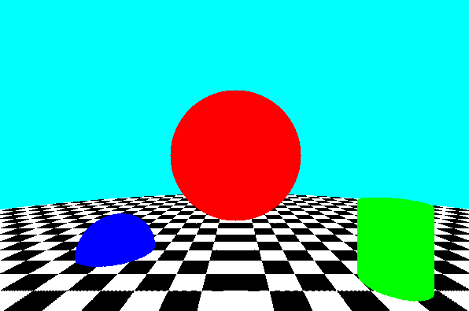
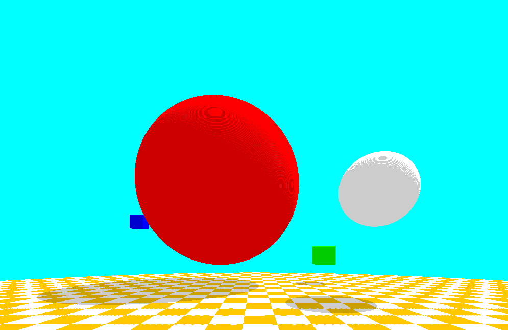
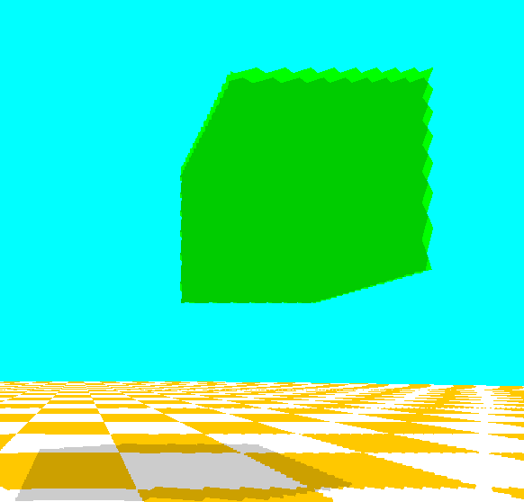

# Úvod

Když jsem se poprvé seznámil s GreenFootem před asi čtyřmi měsíci na střední škole, nevěděl jsem o javě vůbec nic. Hned mě ale napadla otázka: Jak by toto jednoduché programovací prostředí vypadal, kdybych jej vytáhl k jeho absolutním limitům? :D

Takže tady jsem dnes, vytvářím svůj první GitHub repozitář abych mohl zdokumentovat svoji práci.

Níže začnu s takzvanou "kapitoulou 1", je to první prototyp. UPDATE: Po první kapitole navazuje druhá.


### Poznámky:

Jedná se jen o "tech demo". Není to veskutečnosti k ničemu praktické, protože vykreslit jen jeden obrázek trvá nejméně půl minuty :D. 
Není to nejvíce uhlazený skript, v javě jsem začal teprve před čtyřmi měsíci :D

# Kapitola 1
(verze 1)

První prototyp RayTracingu, udělal jsem jej 8.12.2025 během cca. 2 - 3 hodin.

Celá tato verze se nachází ve složce [/RayTracingV1](RayTracingV1/).
Skript, který zde budu dokumentovat je pouze [MyWorld.java](RayTracingV1/MyWorld.java), protože jsem celý raytracer napsal jen do wordu - připadalo mi zbytečné dávat to do aktéra, protože celý engine lze jednoduše rozjet z jedniné třídy.



Nalevo je modrá koule, napůl zanořená do země. Uprostřed červená koule nad zemí. Vpravo zelený válec umíjstěný na zemi.


## Výpočet průsečíku paprsku
Paprsek je pomyslný bod v 3D prostoru s vektorem, jehož poloha je zapsána třemi proměnamy (paprsekX, paprekY, paprsekZ)
Průsečík paprsku je bod, zkrz který bude raytracer posílat paprsek, nachází se v 3D prostoru kus před kamerou a mění se s pozicí pixelu kterého právě chceme rendrovat v 2D scéně

Z platformy scratch.mit.edu (příště odkazuji jen jako scratch :D), jakožto můj první programovací jazyk, jsem byl zvyklí na souřadnicoví systém, kde x0 a y0 byly uprostřed. Greenfoot však má výchozí souřadnici v levém horním rohu, což je pro mě trochu nešikovné. Z tohoto důvodu jsem si v následujícím kódu systém převedl na takový, jaký má scratch.

```java
//Vypočítání průsečíku paprsku
pixelX = (drawX - getWidth()/2) + KameraX;
pixelY = -(drawY - getHeight()/2) + KameraY;
pixelZ = vzdalenostKObrazovce + KameraZ;
```
[> Odkaz na kód <](RayTracingV1/MyWorld.java#L106-L109)

PixelX,Y a Z tady odkazuje na bod kterým skript bude posílat paprsek (průsečík paprsku), odečetl jsem od X a Y polovinu rozměru obrazovky tak, aby byl základní bod uprostřed obrazovky. To napodobuje to souřadnicoví systém jako má scratch.
DrawX a Y odkazují na pixelu na 2D scéně, na který budeme kreslit.
'vzdalenostKObrazovce' je zde proměnná, která funguje jako opačné FOV, čím je větší, tím užšším "tunelem" se budeme dívat.
KameraXYZ je pozice kamery, lze ji na začátku skriptu upravit a pohybovat se tímpádem v prostoru.

PS: paprsekXYZ jsou na začátku světa definované jako privátní double proměnné. KameraXYZ a DrawXYZ jsou private int. 
Otáčení kamery v této verzi ještě není.

## Přípravy na započatí sledování paprsku

```java
//Spočítání vektoru paprsku
zmenVektor(KameraX, KameraY, KameraZ, pixelX, pixelY, pixelZ);

//Započatí sledování paprsku
paprsekX = KameraX;
paprsekY = KameraY;
paprsekZ = KameraZ;
        
krok = 0;
sledovatPaprsek = true;
```
[> Odkaz na kód <](RayTracingV1/MyWorld.java#L111-L120)

Tady se pomocí funkce, kterou vysvětluji níže, spočítá vektor, s kterým se bude paprsek pohybovat.

PaprsekXYZ je pozicí paprsku kterého budeme později při sledování "Tracingu" posouvat vektorem, který směřuje zkrz pixelXYZ (průsečík paprsku). Jeho pozice se zde na začátek nastavuje na pozici kamery - z té bude startovat.
Proměnná 'krok' (int, privátní) je počítadlo, které se bude zvyšovat pokaždé když paprsek posunem vektorem - to je velice důležité - po určitých krocích je třeba paprsek zastavit kdyby do ničeho nenarazil a zamezit tak vzniku nekonečné smyčky.

'sledovatPaprsek' je boolean. Když je true, tak běží sledování paprsku. To jsem udělal tak, že jsem na začátek aktu dal podmínku 'if (sledovatPaprsek) {...}' která vždycky skončí akt pomocí 'return;' dřív, než se rozběhne jakýkoliv skript který jsem doposud zmiňoval. Proměnna se vrátí zpět na false (čímž tuto smyčku ukončí a nechá rozjet skripty víše), jakmile paprsek do něčeho narazí, nebo nedosáhne stropu kroků.

## Dokončení 

Ještě před tím, než začne dlouhá smyčka sledování paprsku tak se dokončí akt, tam už zbývá jen následující kód:

```java
drawX +=1;
if (drawX >= getWidth()) {
        drawX = 0;
        drawY += 1;
}
if (drawY >= getHeight()) {
        Greenfoot.stop();
}
```
[> Odkaz na kód <](RayTracingV1/MyWorld.java#L122-L129)

Tady se zvýší drawX o 1, to se postará o to aby se příště rendroval další pixel - ten na hned napravo toho, který se bude rendrovat teď. Následující podmínka se postarajá o to, aby když se dojde na konec řádku, tak se začne znovu vlevo hned na dalším. Poslední podmínka zastaví engine, jakmile se vyrendruje poslední pixel.

## Funkce    

Před tím, něž se vrhnem na samotné sledování paprsku tak nejdříve musím letmě vysvětlit dvě funkce.

### Výpočet vzdálenosti k bodu

```java
//Spočítání vzdálenosti
public double vzdalenost(double x1, double y1, double z1, double x2, double y2, double z2) {
        double relX = x2 - x1;
        double relY = y2 - y1;
        double relZ = z2 - z1;
        
        return Math.sqrt(relX * relX + relY * relY + relZ * relZ);
}
```
[> Odkaz na kód <](RayTracingV1/MyWorld.java#L132-L139)

Tato funkce je velice jednoduchá. Dosazují se jen dva body v 3D prostoru a vrátí se (return), jak daleko jsou od sebe vzdálený. Funguje to tak, že se spočítá relativní pozici obou bodů, a poté jejich vzdálenost pomocí rozšířené Pythagorovi věty.

### Výpočet a nastavení vektoru

```java
//Změnit vektor
public void zmenVektor(double x1, double y1, double z1, double x2, double y2, double z2) {
        double relX = x2 - x1;
        double relY = y2 - y1;
        double relZ = z2 - z1;
    
        double vzdalenost = Math.sqrt(relX * relX + relY * relY + relZ * relZ);
        
        vektorX = relX / vzdalenost; 
        vektorY = relY / vzdalenost;
        vektorZ = relZ / vzdalenost;
}
```
[> Odkaz na kód <](RayTracingV1/MyWorld.java#L141-L152)

Vektor se počítá jednoduše, vezme se relativní pozice a podělí se vzdáleností.

### Sledování paprsku

```java
if (sledovatPaprsek) {

...

if (krok > 500) {sledovatPaprsek = false;}
krok += 1;
if (sledovatPaprsek) return;
}
```

[> Odkaz na kód <](RayTracingV1/MyWorld.java#L48-L101)

Dokud je boolean 'sledovatPaprsek' true, tak dochází ke smyčce sledování paprsku. Na konci je failsafe, kdyby paprsek do ničeho nenarazil, tak se po 500ti krocích sledování ukončí.
PS: Všechny následující kódy týkající se sledování paprsku jsou od teď umíjsťeny v této podmínce - tam co jsou ty tři tečky :D

### Posunutí paprsku o vektor

```java
paprsekX += vektorX;
paprsekY += vektorY;
paprsekZ += vektorZ;
                    
bg.setColorAt(drawX, drawY, Color.CYAN);
```
[> Odkaz na kód <](RayTracingV1/MyWorld.java#L50-L54)

Tady se paprsek posune o vektor a pixel se vykreslí tyrkysově (barva pozadí, kdyby do ničeho nakonec nenarazil).

### Render šachovnicové podlahy

```java
//Podlaha
if (paprsekY < 0) {

        boolean cerna = false;
                        
        if (Math.abs(paprsekX) % 40 < 20) {
                cerna = true;
        }
        if (Math.abs(paprsekZ) % 40 < 20) {
                cerna = !cerna;
        }                        
                        
        if (cerna) {
                bg.setColorAt(drawX, drawY, Color.BLACK);
        } else {
                bg.setColorAt(drawX, drawY, Color.WHITE);
        }
                sledovatPaprsek = false;
        }
```

[> Odkaz na kód <](RayTracingV1/MyWorld.java#L56-L74)

Tady kontroluji jestli se paprsek nedotýká země (paprsekY < 0) a pokud ano, tak pomocí modulátoru mohu udělat podlahu lajnovanou a převrátit barvy podla kolmíma lajnama.

### Render objektů

```java
//Koule 1
if (vzdalenost(paprsekX, paprsekY, paprsekZ, 0, 80, 150) < 40) {
        bg.setColorAt(drawX, drawY, Color.RED);
        sledovatPaprsek = false;
 }
                    
//Koule 2
if (vzdalenost(paprsekX, paprsekY, paprsekZ, -100, 0, 200) < 30) {
        bg.setColorAt(drawX, drawY, Color.BLUE);
        sledovatPaprsek = false;
}
                
//Válec
if (vzdalenost(paprsekX, paprsekY, paprsekZ, 100, paprsekY, 150) < 20) {        
        if (paprsekY < 50) {
                bg.setColorAt(drawX, drawY, Color.GREEN);
                sledovatPaprsek = false;
        }    
}        
```

[> Odkaz na kód <](RayTracingV1/MyWorld.java#L76-L96)

Renderování koule je jednoduché, pouze zkontrolujeme, jestli pozice paprsku je v určité vzdálenosti od fixního bodu středu koule. A u válce je to to stejné, ale neřešíme výškovou souřadnici u vzdálenosti, jen druhou podmínkou nastavíme výšku, jinak by byl nekonečně vysoký.

# Kapitola 2
(verze 2)

Druhý Prototyp Raytracingu, napsán 12.4.2026. Začal jsem v 7 ráno a na oběd končil (takže asi 5 hodin vkuse programování + byl výkend btw)

Zdravím. Po asi čtyřech měsících jsem zpět, protože jsem se dokopal udělat druhou verzi. Ano, celý jsem to odzákladů přepsal, protože moje znalosti javy se výrazně zlepšily a došlo mi, jak lépe a čistěji mohu ten kód napsat.

Vektory, pozice těles a paprsků jsem uklidil do samostatné třídy, a místo pomalích metod act() ve kterých jsem prováděl hlavní smyčku renderu teď používám smyčky 'for'. To způsobilo výrazné zrychlení renderování. Nyní tedy místo asi minuty čekáme na obrázek jen tři vteřiny - Jupí :D

Celý engine nově všude používá float namísto double, což zlepšuje výrazně rychlost bez viditelných ztrát kvality renderu.




Oproti předchozí verzi jsou po grafické stránce nové pouze stíny, ale kód je mnohem čistší a rychlejší, což výrazně zlepší implementaci odlesků a dalších optimalizacích v budoucnu.

Tato verze také implementuje pohyb pomocí kláves WASD, takže si to můžete vyzkoušet - ale čekejte 0.3FPS

To je k mé rychlé dokumentaci druhé verze zatím vše, tak zase do příští verze - Naviděnou! :D

# Kapitola 3
(verze 2.1)

25.04.2026
Udělal jsem velké pokroky co se výkonu týče. Před přidáváním odlesků a dalších věcí musí engine běžet rychleji, jinak bude jeden render trvat neskutečně dlouho.

### 1. Optimalizace
Detekce, jestli paprsek narazil do koule probíhá tak, že se spočítá jestli vzdálenost od středu koule k paprsku je menší než její poloměr.

Při výpočtu vzdálenosti používám pythagorovu větu. Ta pužívá odmocninu. Tady lze udělat malý fígl - přeskočit odmocňování a potom porovnat neodmocněnou vzdálenost s umocněným poloměrem koule.

To znamená že v každém kroku ušetříme jednu odmocninu za každou kouli ve světě.

Vzhledem k tomu, že rozlišení je 1000x650, každý paprsek má maximální životnost 700 kroků a ve světě jsou dvě koule, tak toto ušetřilo javě 496 160 201 odmocnin (počítáno přes debug counter).


A výsledek v rychlosti?

Z původních 2800ms na obrázek jsem se dostal na 2700ms na obrázek.
To znamená že java jen tak přechroustá půl miliardy odmocnin za desetinu sekundy. -_-

### 2. Optimalizace
Tahle optimalizace je velice účinná narozdíl od předchozí. Spočívá v tom že před vysláním paprsku si udělám obdelník kolem bodu kde paprsek vyráží a bodu kde končí. Poté vyberu pouze objekty, které jsou v těchto hranicích a pouze u těchto kontroluji kolize.


Bez optimalizace:

`Počet kontrol kolizí: 1 240 016 438
Doba zpracování: 2 721 ms`


S optimalizací:

`Počet kontrol kolizí: 464 440 139
Doba zpracování: 1 648 ms`

### Závěr kapitoly

Tahle kapitola byla velice úspěšná. Raytracing nyní ušetří víc jak jednu sekundu času. Ale to už je ode mě všechno. Příští kapitola bude v sobě mít už odlesky, takže se máte na co těšit :D

## Závěr Projektu
Děkuji mockrát za čtení této dokumentace, pokud se vám moje tvorba líbí, prosím zvažte podporu hvězdičkou na projekt případný follow na můj účet.
